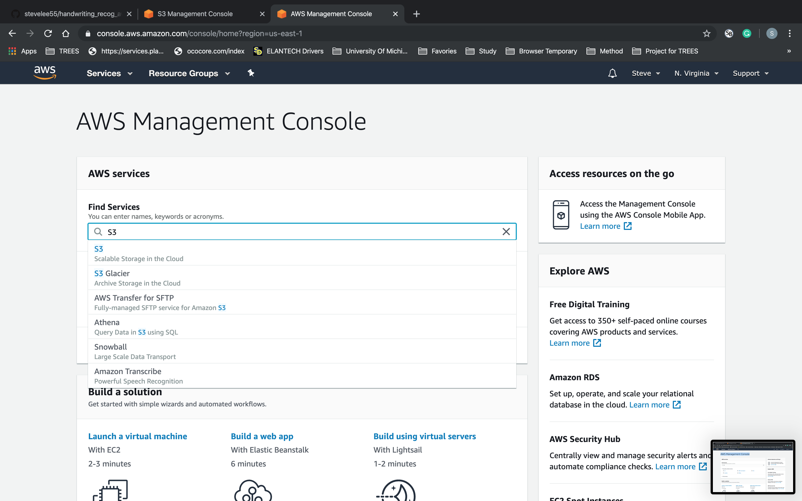
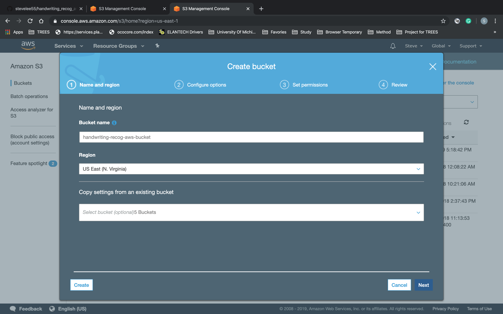
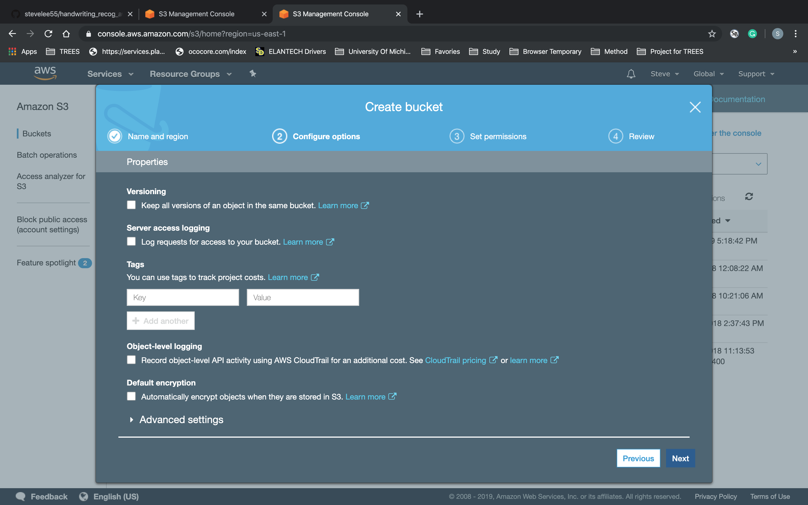
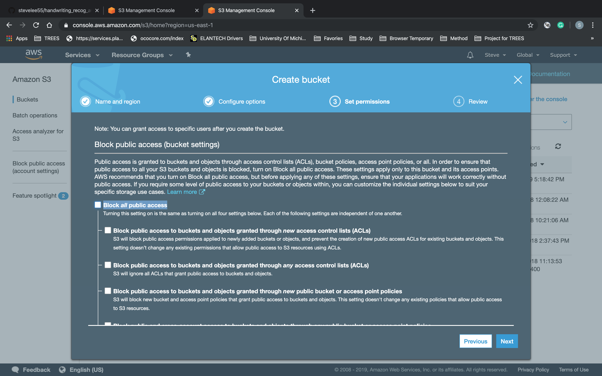

# __handwriting_recog_aws__

## Pipeline Overview
* This pipeline allows a user to test his/her trained onnx model via AWS Lambda.
* User can upload his/her onnx model to Lambda by uploading model.onnx file directly to an Amazon S3 bucket.
* User can then test his/her onnx model by uploading a digit.png file directly to the an S3 bucket.
* When the digit.png is uploaded to Amazon S3, Lambda is triggered and runs the load_model_infer.py script that loads model.onnx from Amazon S3 bucket, makes an inference for the digit.png file from Amazon S3 bucket, and saves results to results.txt and uploads it to the an Amazon S3 bucket - the user can download and view the results.txt from Amazon S3 bucket.

### Pipeline Data Flow Diagram

## Building the Pipeline Overview
1. Create an AWS Account
2. Setup Amazon S3 (AWS)
3. Setup Amazon Lambda (AWS)
4. Upload model.onnx to Amazon S3
5. Run-through the pipeline

### Create an AWS Account
1. Follow the steps on this page: https://aws.amazon.com/premiumsupport/knowledge-center/create-and-activate-aws-account/

### Setup Amazon S3 (AWS)
1. Go to the "AWS Management Console", search for "S3" in the search field, and select it to go to the Amazon S3 console page.

2. Click on the "Create Bucket", specify bucket name (in this example, we named ours "handwriting-recog-aws-bucket"), and click "Next" - leave everything at their default values.

3. Click "Next" - leave everything at their default values.

4. Un-check the checkbox next to "Block all public access" - this is never a good idea for production-level products, but this is done only for this project to make the pipeline setup process go smoother. After un-checking the checkbox, click "Next".

5. 
