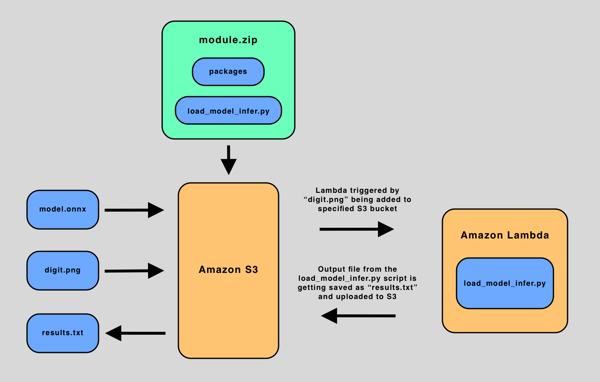

# __handwriting_recog_aws__

## Pipeline Overview
* This pipeline allows a user to test his/her trained onnx model via AWS Lambda.
* User can upload his/her onnx model to Lambda by uploading model.onnx file directly to an Amazon S3 bucket.
* User can then test his/her onnx model by uploading a digit.png file directly to the an S3 bucket.
* When the digit.png is uploaded to Amazon S3, Lambda is triggered and runs the load_model_infer.py script that loads model.onnx from Amazon S3 bucket, makes an inference for the digit.png file from Amazon S3 bucket, and saves results to results.txt and uploads it to the an Amazon S3 bucket - the user can download and view the results.txt from Amazon S3 bucket.

### Pipeline Data Flow Diagram

