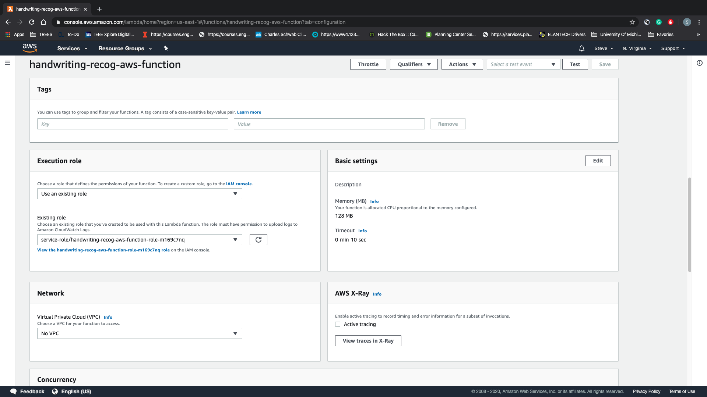

# __handwriting_recog_aws__
Maintainer: stevesl@umich.edu

## Pipeline Overview
* This pipeline allows a user to test his/her trained onnx model via AWS Lambda.
* User can upload his/her onnx model to Lambda by uploading model.onnx file directly to an Amazon S3 bucket.
* User can then test his/her onnx model by uploading a digit.png file directly to the an S3 bucket.
* When the digit.png is uploaded to Amazon S3, Lambda is triggered and runs the load_model_infer.py script that loads model.onnx from Amazon S3 bucket, makes an inference for the digit.png file from Amazon S3 bucket, and saves results to results.txt and uploads it to the an Amazon S3 bucket - the user can download and view the results.txt from Amazon S3 bucket.

### Pipeline Data Flow Diagram

## Building the Pipeline Overview
0. Create "module.zip"
1. Create an AWS Account
2. Setup Amazon S3 (AWS)
3. Setup Amazon Lambda (AWS)
4. Upload model.onnx and module.zip to Amazon S3
5. Load module.zip (load_model.infer.py and packages) to the Lambda
6. Run-through the pipeline

### Create "module.zip"
1. Locate "load_model_infer.py" file and "packages" directory in "files_for_amazon_s3" directory.
2. Open up "load_model.infer.py" and change "<your-unique-s3-bucket-name>" to s3 bucket name that is (literally)globally unique - we'd suggest use combination of your uniquename and "umich.edu".
3. Zip "load_model_infer.py" and "packages", and rename the .zip file "module.zip".

### Create an AWS Account
1. Follow the steps on this page: https://aws.amazon.com/premiumsupport/knowledge-center/create-and-activate-aws-account/

### Setup Amazon S3 (AWS)
1. Go to the "AWS Management Console", search for "S3" in the search field, and select it to go to the Amazon S3 console page.

2. Click on the "Create Bucket", specify bucket name as "handwriting-recog-aws-bucket" (it has to be this name since the load_model_infer.py looks for "handwriting-recog-aws-bucket" when accessing Amazon S3), and click "Next" - leave everything at their default values.

3. Click "Next" - leave everything at their default values.

4. Un-check the checkbox next to "Block all public access" - this is never a good idea for production-level products, but this is done only for this project to make the pipeline setup process go smoother. After un-checking the checkbox, click "Next".

5. Click "Create bucket" - leave everything at their default values.

6. You should be able to see the name of the bucket that you just created. Click on it to go to the bucket's console/edit page.

7. This is your Amazon S3 bucket's console/edit page - this is where you will later upload module.zip, model.onnx, and digit.png to and where you will receive the results.txt file from Amazon Lambda.

### Setup Amazon Lambda (AWS)
1. Go to the "AWS Management Console", search for "Lambda" in the search field, and select it to go to the Amazon Lambda console page.

2. Click on the "Create function", specify function name (in this example, we named ours "handwriting-recog-aws-function"), set "Runtime" as "Python3.6", and click "Create function" - leave everything at their default values.

3. Once you click the "Create function", you will be taken to the Lambda console page. Start configuring by first clicking "+ Add trigger".

4. Once you are at the "Add trigger" page, search for S3 in the search field and click on it.

5. Once the "Trigger configuration" options appear, start configuring them - set "Bucket" to the Amazon S3 bucket you created previously, "Event type" to "PUT", leave "Prefix" blank, "Suffix" to ".png", and check the "Enable trigger" checkbox. Click "Add".

6. Once you are back at the Lambda console page, click on the "handwriting-recog-aws-function" button at the center of the page to go to the Lambda function editing/configuring page.

7. Once the Lambda function editing/configuring page is loaded, scroll down to the section named "Execution role". Once you are there, in the search field under the "Existing role" option, search for "lambda-with-s3-fullaccess" and select it - this gives Lambda access to Amazon S3's contents, such as buckets and contents inside of the buckets, etc.

8. Once "Execution role" is set, take a look at the "Basic settings" section. Under "Timeout" set the value to 10 seconds. Afterwards, click "Save" button located at the upper right of the Lambda console page.

9. Awesome! Your Amazon Lambda setup is complete - we will come back to this console to upload module.zip, located in Amazon S3, to Lambda, which contains the load_model_infer.py script and the python packages needed to run the script.

### Upload model.onnx and module.zip to Amazon S3
1. To upload model.onnx and module.zip to Amazon S3 (files located inside of the directory "files_for_amazon_s3"), go back to your Amazon S3 bucket's console/edit page, and drag-and-drop model.onnx and module.zip onto the main console page - a pop up will show up asking you to do configurations, but there is nothing more to configure, so just click through all of the "Next"s and click "Upload".

2. Once the files are uploaded, you are completely done with Amazon S3 setup! :) - we will later come back to this page to upload digit.png to run the whole pipeline.

### Load module.zip (load_model.infer.py and packages) to Amazon Lambda
1. To load module.zip, which contains load_model_infer.py and necessary python packages, to Lambda, go back to your Lambda function console page. Once you are there, scroll down to find the section "Function code" and select "Upload a file from Amazon S3" under the "Code entry type". Afterwards, set "Handler" field to "load_model_infer.lambda_handler".

2. Once you select "Upload a file from Amazon S3", you will now see the field "Amazon S3 link URL". To get this URL, go back to your Amazon S3 bucket console, click module.zip (this will take you another page that has details about module.zip), and click "Copy path".

3. After you get the "Amazon S3 link URL" for module.zip, go back to your Lambda function console page and paste it into the field "Amazon S3 link URL". Click "Save" button located at the upper right of the Lambda console to save the module.zip into your Lambda function.

4. Awesome! Your module.zip (load_model.infer.py and packages) is now loaded into your Lambda function. This method of uploading code is used whenever the size of the code and the packages/dependencies are too large in size.

### Run-through the pipeline (Finally!)
Now that your AWS pipeline setup is complete, it's now time to test it.

1. To begin locate digit.png under "test_images" directory. **Note: Before you run an image through the pipeline, make sure to rename the image to "digit.png".**
2. Once you have located the digit.png, go to your Amazon S3 bucket console. Once you are at the Amazon S3 bucket console, drag-and-drop the digit.png onto the console. Upload the image the way you uploaded files previously - do not configure anything, just click through the "Next"s and click "Upload".

3. After you upload it, refresh the Amazon S3 bucket console page - you should be able to see the results.txt within your Amazon S3 bucket.

4. Download the results.txt to take a look at the inference results made by your onnx model - this shows that the model predicted that the uploaded digit.png is "1" with 0.573457 probability, which is (somewhat) correct!

results.txt

digit.png

## Things to consider/think about when-creating/after-creating this pipeline

After you've created this pipeline and started testing with different images, you will notice that the results are not as good as the results from this demo https://microsoft.github.io/onnxjs-demo/#/mnist, which uses the exact same model that we are using to predict images that we are using - the test images that are included are also generated from this demo website. Why does this happen?

1. This could be caused by the way we are currently converting raw-input images into 28 x 28. In this pipeline, the image conversion happens in the "load_model_infer.py" - take a look at the script and see if anything could be changed to get better results. Once you find a way to make it better, test it locally and try deploying the new script to the Lambda and test it.

As you are attempting to modify the script and re-deploy it to AWS, you will quickly realize there are various things to consider. You will start to have questions like, "how do I test the new script locally?" or "why do I get this error when I upload my new module.zip?". Here are some of the most common things that come up very quickly.

1. "How do I test the new script locally?"
- There are many ways to do this, but the key thing is that you need to test the script in an environment that is exactly the same or very similar to the environment in Amazon Lambda. Amazon Lambda is a Linux environment, so what I, personally, did was creating a Linux Docker container and run the script in it - this is one of the fastest ways to get Linux environment setup and up and running quickly.

2. "Why do I get an error when I try to upload a new module.zip" to Lambda via Amazon S3?"
- This could be happening for various reasons, but one of the most common causes for this issue is the way you are "zipping" or "compressing" the files (load_model_infer.py and model.onnx) - you should not zip the folder that the files are in, but you should select the two files and zip them instead.

